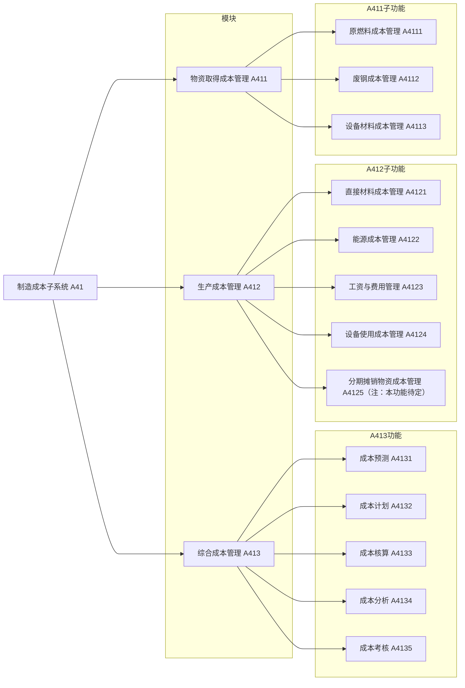
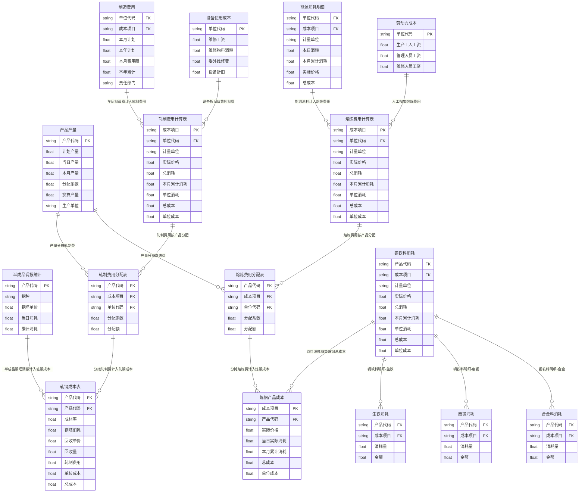
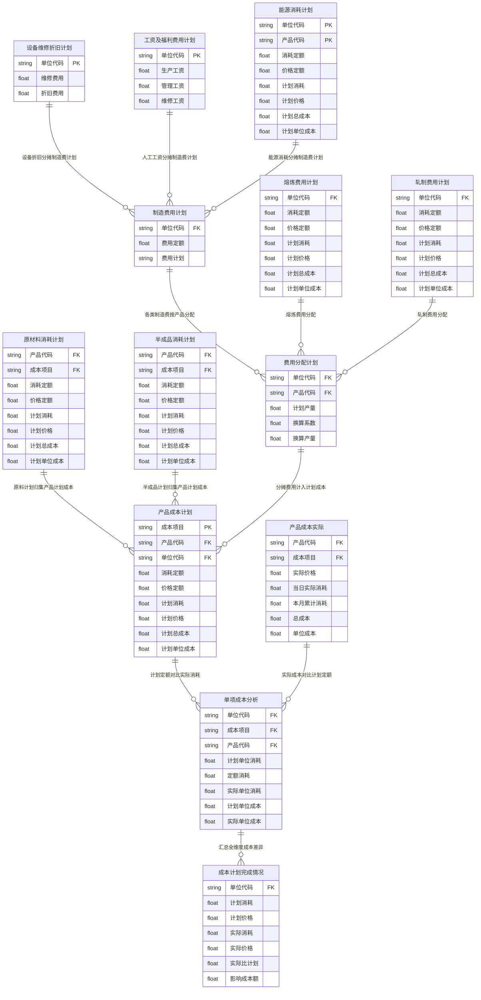
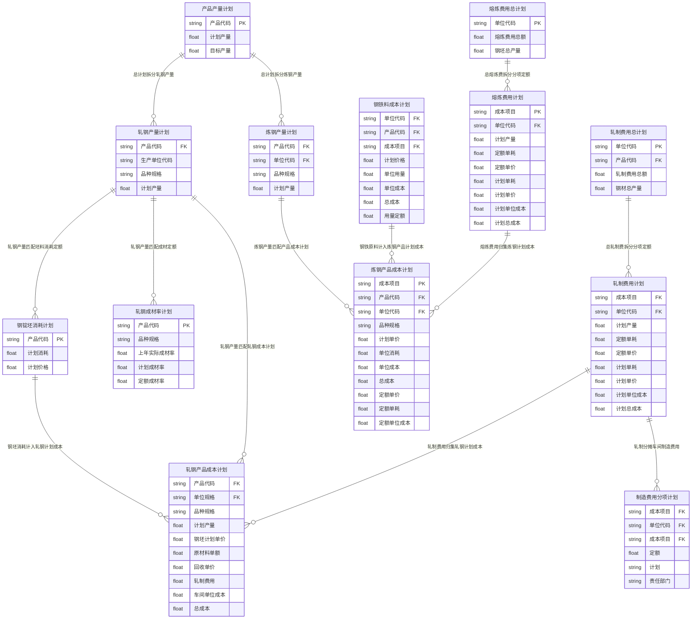

## 附录1:成本管理子系统功能树图

制造成本子系统 A41<br>
├─ 物资取得成本管理 A411<br>
│ ├─ 原燃料成本管理 A4111
│ ├─ 废钢成本管理 A4112
│ └─ 设备材料成本管理 A4113
├─ 生产成本管理 A412
│ ├─ 直接材料成本管理 A4121
│ ├─ 能源成本管理 A4122
│ ├─ 工资与费用管理 A4123
│ ├─ 设备使用成本管理 A4124
│ └─ 分期摊销物资成本管理 A4125（注：本功能待定）
└─ 综合成本管理 A413
├─ 成本预测 A4131
├─ 成本计划 A4132
├─ 成本核算 A4133
├─ 成本分析 A4134
└─ 成本考核 A4135
---

---
## 附录2  功能模型IDEF0图
### A41
### A411
### A412
### A413
## 附录3  信息模型IDEF1X图
整套钢铁全流程成本系统ER图 Mermaid erDiagram 完整代码，分5段独立代码，分别对应5张图纸
图1：炼焦成本核算ER图
图2：烧结矿实际成本核算ER图
图3：炼钢&轧钢实际成本核算ER图
图4：全流程成本计划/分析ER图
图5：炼钢轧钢产量&产品成本计划ER图

### 图1：炼焦成本核算ER图
```mermaid
erDiagram
    %% 基础费用表
    能源消耗 {
        string 单位代码 PK
        string 能源项目
        float 消耗量
        float 金额
    }
    工资 {
        string 单位代码 PK
        float 生产工人工资
        float 管理人员工资
        float 维修人员工资
    }
    制造费用 {
        string 费用项目 PK
        float 金额
    }
    设备维修折旧 {
        string 单位代码 PK
        float 折旧费
        float 维修费
        float 维修工资
    }

    %% 产量、分配系数基础表
    换算系数 {
        string 产品代码 PK
        float 换算系数
    }
    产品产量 {
        string 产品代码 PK
        float 本日产量
        float 本月累计
        float 计划产量
    }
    分配系数 {
        string 产品代码 PK
        float 能源分配系数
        float 制造费用分配系数
        float 人工费用分配系数
    }

    %% 费用分配、成本分离中间表
    费用分配表 {
        string 产品代码 FK
        float 工资
        float 制造费用
        float 能源
        float 维修折旧费用
    }
    成本分离计算表 {
        string 产品代码 FK
        float 换算产量
        float 分离成本
    }

    %% 物料消耗明细
    炼焦煤耗 {
        string 材料代码 PK
        string 成本项目 FK
        float 本日消耗
        float 本月累计消耗
    }
    材料消耗 {
        string 产品代码 FK
        string 成本项目 FK
        float 实际消耗
        float 实际价格
        float 成本
    }
    副产品成本 {
        string 产品代码 FK
        string 成本项目 FK
        float 实际消耗
        float 总成本
    }

    %% 成本汇总表
    炼焦成本 {
        string 成本项目 PK
        float 实际消耗
        float 单位成本
        float 总成本
    }
    炼焦产品成本总 {
        string 产品代码 FK
        string 成本项目 FK
        float 产量
        float 总成本
        float 单位成本
    }

    %% 关联关系 1对多 ||--o{
    能源消耗 ||--o{ 费用分配表 : "单位代码分摊"
    工资 ||--o{ 费用分配表 : "单位代码分摊"
    制造费用 ||--o{ 费用分配表 : "费用项目分摊"
    设备维修折旧 ||--o{ 费用分配表 : "单位代码分摊"

    产品产量 ||--o{ 成本分离计算表 : "产量换算分离"
    换算系数 ||--o{ 成本分离计算表 : "换算产量系数"
    分配系数 ||--o{ 费用分配表 : "按产品分配各项费用"

    炼焦煤耗 ||--o{ 材料消耗 : "煤料明细归集"
    材料消耗 ||--o{ 副产品成本 : "物料消耗分出副产品"
    副产品成本 ||--o{ 炼焦产品成本总 : "副产品冲减总成本"
    费用分配表 ||--o{ 炼焦成本 : "分摊费用归集成本项目"
    成本分离计算表 ||--o{ 炼焦产品成本总 : "分离成本归集产品"
    炼焦成本 ||--o{ 炼焦产品成本总 : "成本项目汇总产品总成本"
  ```
### 图2：烧结矿实际成本ER图
```mermaid
erDiagram
    %% 顶层汇总&计划
    产品产量计划 {
        string 产品代码 PK
        date 日期
        float 计划产量
        float 目标产量
    }
    烧结矿生铁成本表 {
        string 产品代码 FK
        string 成本项目 FK
        float 当日消耗
        float 本旬累计
        float 本月累计消耗
        float 实际价格
        float 单位成本
        float 总成本
    }
    产品成本预测表 {
        string 产品代码 FK
        string 成本项目 FK
        date 日期 FK
        float 预测总成本
        float 预测单位成本
    }

    %% 六大成本分类统计表
    原材料消耗统计 {
        string 成本项目 FK
        string 产品代码 FK
        float 本日消耗
        float 本月消耗
        float 实际价格
    }
    能源消耗统计 {
        string 成本项目 FK
        string 产品代码 FK
        float 本日消耗
        float 本月消耗
        float 实际价格
    }
    备品配件消耗 {
        string 成本项目 FK
        string 产品代码 FK
        float 本日消耗
        float 本月消耗
        float 实际价格
    }
    设备成本统计 {
        string 成本项目 FK
        string 产品代码 FK
        float 本日
        float 本月
        float 实际价格
    }
    劳动力成本统计 {
        string 成本项目 FK
        string 产品代码 FK
        float 本日
        float 本月累计实际
    }
    制造费用统计 {
        string 成本项目 FK
        string 产品代码 FK
        float 本日平均
        float 本月实际
    }

    %% 底层原始业务单据
    材料消耗表 {
        string 单位代码 PK
        string 物料代码 PK
        date 日期
        float 领用量
        float 单位价格
        string 用途
    }
    能源平衡表 {
        string 单位代码 PK
        string 能源代码 PK
        date 日期
        string 计量单位
        float 消耗量
        float 实际单价
        float 消耗金额
    }
    备品配件消耗表 {
        string 单位代码 PK
        string 材料代码 PK
        date 日期
        float 本月消耗
        float 实际价格
        string 用途
    }
    设备维修折旧单据 {
        string 单位代码 PK
        date 日期
        float 维修费用
        float 折旧费用
    }
    劳动力成本单据 {
        string 单位代码 PK
        date 日期
        float 生产工资
        float 管理工资
        float 维修工资
    }

    %% 关联关系
    产品产量计划 ||--o{ 产品成本预测表 : "产量驱动成本预测"
    烧结矿生铁成本表 ||--o{ 原材料消耗统计 : "归集原料消耗"
    烧结矿生铁成本表 ||--o{ 能源消耗统计 : "归集能源消耗"
    烧结矿生铁成本表 ||--o{ 备品配件消耗 : "归集备件消耗"
    烧结矿生铁成本表 ||--o{ 设备成本统计 : "归集设备折旧维修"
    烧结矿生铁成本表 ||--o{ 劳动力成本统计 : "归集人工工资"
    烧结矿生铁成本表 ||--o{ 制造费用统计 : "归集车间制造费"

    材料消耗表 ||--o{ 原材料消耗统计 : "领料汇总原料消耗"
    能源平衡表 ||--o{ 能源消耗统计 : "能源平衡汇总消耗"
    备品配件消耗表 ||--o{ 备品配件消耗 : "备件领用汇总统计"
    设备维修折旧单据 ||--o{ 设备成本统计 : "折旧维修归集设备成本"
    劳动力成本单据 ||--o{ 劳动力成本统计 : "工资单据归集人工成本"
```
### 图3：炼钢&轧钢实际成本核算ER图

### 图4：全流程成本计划与成本分析ER图

### 图5：炼钢轧钢产量&产品成本计划ER图

## 附录4  LGCIMS全局信息关联图
